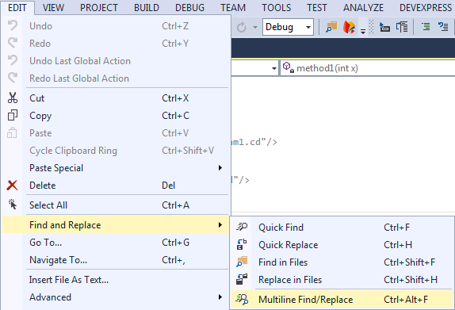
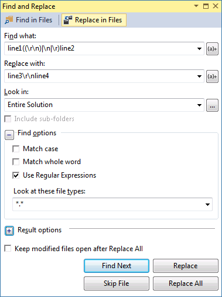
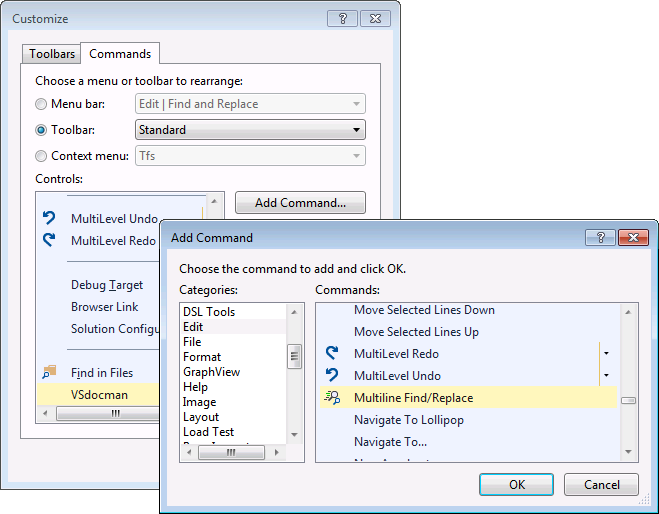
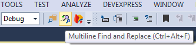

# Multiline Search and Replace for Visual Studio

This extension allows multiline search and replace in Visual Studio (not VS Code). This is a user-friendly GUI wrapper over standard VS "Find" and "Find in Files" dialog. You don't have to use the regex syntax, the extension takes care of it. It also allows to save your searches.

After installing, a new **Multiline Find/Replace** menu item is created under Edit - Find and Replace.

When you invoke the command, you can insert multiline text in both **Find what** and **Replace with** fields.

You can set various options for how to handle whitespaces. See the help for more details.

According to which find or replace button you press, the standard VS find/replace dialog appears. All required fields are correctly prepopulated. That means Find what and Replace with fields contain the regular expressions for newlines. Moreover, the **Use Regular Expressions** option is automatically selected.

Now you know it. You can search and replace as usual.

##Customization

Predefined keyboard shortcut for the multiline search command is **Ctrl+M**, **Ctrl+F**. If you want to change it (for example because the shortcut is already used) you can do it in **Tools** - **Options...** menu. Navigate to **Environment** - **Keyboard**. Type "multiline" in **Show commands containing** field. You should see **Edit.MultilineFindReplace** command for which you can change the shortcut.

To add the command to your toolbar, right click on the toolbar and select **Customize**. Switch to **Commands** tab. Select Toolbar: Standard and press **Add command**. Select **Edit** category and **Multiline Find/Replace** command.

And now it's always at your hand.

